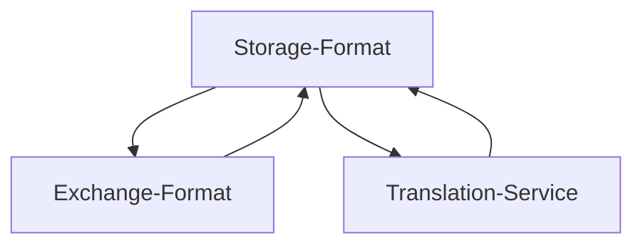

<p align="center">
   
</p>


Welcome to PHPUnuhi - The easy composable framework to validate and manage translations!

Unuhi? This is Hawaiian for "translate" or "translation".

Why did I create it? Just curiosity and because I needed something like this :)
The framework is free, there's no guarantee or claim to anything.

Now that you know this, let's get started!

<!-- TOC -->
  * [1. Basic Concept](#1-basic-concept)
  * [2. Installation](#2-installation)
  * [3. Configuration](#3-configuration)
  * [4. Commands](#4-commands)
    * [4.1 Validate Command](#41-validate-command)
    * [4.2 Fix Structure Command](#42-fix-structure-command)
    * [4.3 Export Command](#43-export-command)
    * [4.4 Import Command](#44-import-command)
    * [4.5 Status Command](#45-status-command)
    * [4.6 Translate Command](#46-translate-command)
  * [5. Use Cases](#5-use-cases)
    * [5.1 Validation in CI pipeline](#51-validation-in-ci-pipeline)
    * [5.2 Working with external translation agencies](#52-working-with-external-translation-agencies)
    * [5.3 Live WebEdit with HTML](#53-live-webedit-with-html)
    * [5.4 Automatic Translation with Google, DeepL, ...](#54-automatic-translation-with-google-deepl-)
  * [6. Warning](#6-warning)
  * [7. Appendix](#7-appendix)
    * [7.1 Storage Formats](#71-storage-formats)
      * [7.1.1 JSON](#711-json)
      * [7.1.2 INI](#712-ini)
      * [7.1.3 PHP](#713-php)
      * [7.1.4 Shopware 6](#714-shopware-6)
    * [7.2 Filters](#72-filters)
    * [7.3 Groups](#73-groups)
    * [7.4 Exchange Formats](#74-exchange-formats)
      * [7.4.1 CSV](#741-csv)
      * [7.4.2 HTML / WebEdit](#742-html--webedit)
    * [7.5 Translator Services](#75-translator-services)
      * [7.5.1 DeepL](#751-deepl)
      * [7.5.2 Google Cloud Translate](#752-google-cloud-translate)
      * [7.5.3 Google Web Translate](#753-google-web-translate)
      * [7.5.4 OpenAI GPT Translate](#754-openai-gpt-translate)
<!-- TOC -->

## 1. Basic Concept

This is a framework that helps you to **validate and maintain translations**.

Although it's not dependent on a specific platform, you can use it perfectly with Shopware 6 and other platforms.

For example, Shopware 6 has snippets based on JSON files.
If you develop plugins for this platform, you can build translation sets in PHPUnuhi that contain all your files for the individual languages, like EN, DE, NL, and whatever you support.
PHPUnuhi helps you to make sure you didn't forget any translations, screwed up structures across your language files and even
helps you to export and import or translate your entries.

One of the benefits of this framework is the approach of decoupled **Storage formats**, **Exchange formats** and **Translation services**.
You can combine any storage format (JSON, INI, DB, ...) with any exchange format for import + exports (CSV, HTML, ...) or use any of the provided
translation services (Google, DeepL, OpenAI). This makes PHPUnuhi a great **composable framework for translations**.



**Key Benefits**

* Validates structure and content
* Platform independent and composable framework with different components.
* Exchange formats such as CSV and HTML
* Live WebEdit with HTML exchange format
* Automatic translation using OpenAI (experimental), DeepL, Google and more

<p align="center">
   
</p>


> Missing your platform or file format? Feel free to contribute :)

## 2. Installation

You can use PHPUnuhi with Composer. Just install it with this script.

```
composer require boxblinkracer/phpunuhi
```

You can then run it with this command, once you have a configuration.

```
php vendor/bin/phpunuhi validate
```

## 3. Configuration

The whole configuration is done using XML.

You can create different **Translation-Sets** in a configuration.

A single **Translation-Set** contains one or more **locales**.

A locale is usually defined by a **single file** that contains the actual **translations** in this locale.
But depending on the used storage format, it could also automatically search something in the database, etc.

This means, a single **Translation-Set** consists of **multiple locales** that should all match in their structure,
but have different values for their translations.

How you define such a Translation-Set is totally up to you.

Let's create a new **phpunuhi.xml** file (or rename it to something else).

```xml

<phpunuhi
        xmlns:xsi="http://www.w3.org/2001/XMLSchema-instance"
        xsi:noNamespaceSchemaLocation="./vendor/boxblinkracer/phpunuhi/config.xsd"
>
    <translations>

        <set name="Storefront">
            <locales>
                <locale name="de">./snippets/storefront/de.json</locale>
                <locale name="en">./snippets/storefront/en.json</locale>
            </locales>
        </set>

    </translations>
</phpunuhi>
```

This was a simple configuration, but you can also do way more.
Look at this one:

```xml

<phpunuhi
        xmlns:xsi="http://www.w3.org/2001/XMLSchema-instance"
        xsi:noNamespaceSchemaLocation="./vendor/boxblinkracer/phpunuhi/config.xsd"
>
    <translations>

        <set name="Storefront JSON">
            <format>
                <json indent="4" sort="true"></json>
            </format>
            <locales>
                <locale name="de">./snippets/de.json</locale>
                <locale name="en">./snippets/en.json</locale>
            </locales>
        </set>

        <set name="Products">
            <format>
                <shopware6 entity="product"></shopware6>
            </format>
            <filter>
                <exclude>
                    <key>meta_*</key>
                </exclude>
            </filter>
            <locales>
                <locale name="de-DE"></locale>
                <locale name="en-GB"></locale>
            </locales>
        </set>

    </translations>
</phpunuhi>
```

Every set can have its own **storage format** (default is JSON).

Some storage formats, such as JSON, have individual attributes that can be defined in the Translation-Set.

> Read more about optional attributes in the storage-format section in the appendix below.

## 4. Commands

### 4.1 Validate Command

Start the validation of your translation files by running this command:

```bash 
# loads configuration phpunuhi.xml as default
php vendor/bin/phpunuhi validate 

# provide custom configuration
php vendor/bin/phpunuhi validate --configuration=./translations.xml
```

**Invalid structure**

The command will check if all files of a translation set have the **same structure**.
If not, you might have forgotten something ;)

<p align="center">
   
</p>

**Missing translations**

If missing translations (**empty values**) are found, the validation process will fail.
This helps against forgetting certain translations in any of your files.

<p align="center">
   
</p>

### 4.2 Fix Structure Command

If your storage files are not matching, you can easily use the fixing command to make sure they are in sync.
Please note, that this will only create empty translations so that the structure is the same.

The final translations are not 100% valid in the end...only existing!

```bash 
# Fixes all sets of the configuration
php vendor/bin/phpunuhi fix:structure

# Fixes only a provided set of your configuration
php vendor/bin/phpunuhi fix:structure --set="storefront"
```

<p align="center">
   
</p>

### 4.3 Export Command

You can export your translations **into a CSV file**, a HTML WebEdit spreadsheet, or other supported exchange formats.
These files can then be passed on to an external translator or company.

Every row will contain the translation key, and every column in that row will be a different translation (in case of CSV files).

```bash 
# default export in default exchange format CSV
php vendor/bin/phpunuhi export 

# default export in specific exchange format
php vendor/bin/phpunuhi export ... --format=html

# provide custom export folder
php vendor/bin/phpunuhi export ... --dir=./exports

# only export single set "storefront"
php vendor/bin/phpunuhi export ... --set="storefront"
```

> For more options and arguments of the formats please see the appendix below!

<p align="center">
   
</p>

### 4.4 Import Command

You can import your translations **from a CSV file** or other supported exchange formats.
This will automatically update the storage files (JSON, ...) that have been assigned to the imported translation set.

> It's recommended to use version control to verify changes, before approving them.

```bash 
# import from default format CSV
php vendor/bin/phpunuhi import --set=storefront --file=storefront.csv

# import with other exchange format
php vendor/bin/phpunuhi import ... --format=html
```

### 4.5 Status Command

Use this command to get the coverage status of your translations.

```bash 
php vendor/bin/phpunuhi status 
```

<p align="center">
   
</p>

### 4.6 Translate Command

PHPUnuhi includes the option to use external services to automatically translate missing values for you.

The **translate** command will search for empty values in your translations.

If an empty translation is found, it will request a translation from your external service.
The text that will be translated in this request, is the translation from another language.

For instance, if your "English" translation is empty, PHPUnuhi will find your "German" text and send it to the external service.
The English result is then saved in your storage.

```bash 
# translate using GoogleWeb
php vendor/bin/phpunuhi translate --service=googleweb

# translate using DeepL
php vendor/bin/phpunuhi translate --service=deepl --deepl-key=xyz

# translate only the set "storefront"
php vendor/bin/phpunuhi translate ... --set="storefront"

# force the translation of "en". This will translate everything, not only empty values
php vendor/bin/phpunuhi translate ...  --force=en
```

> For more options and arguments of the formats please see the appendix below!

<p align="center">
   
</p>

## 5. Use Cases

Here are a few use cases and ideas to get you started.

### 5.1 Validation in CI pipeline

One of the typical things you want to make sure is, that your plugin/software doesn't miss any
required translations.

This can be done directly within your CI pipeline. Just install your dependencies and run the validation command.
The exit value of this command will automatically stop your pipeline if an error is detected.

### 5.2 Working with external translation agencies

External translation agencies often require CSV exports.
You can easily generate and export a CSV file for your partner agencies.

Once they have adjusted their translation, they can send you the file back and you simply
import it again with the import command.

### 5.3 Live WebEdit with HTML

If you have a test or staging system, you can even go one step further.
Just imagine setting up a cronjob that runs after a deployment, or as scheduled job.
This cronjob could trigger the HTML export of PHPUnuhi with an output directory to a folder that is available within your DocRoot.
That HTML file might then be exposed with something like this **https://stage.my-shop.com/snippets**.

Everyone who wants to either see all translations, or even modify them, can easily do this in their browser.
And because you use a cronjob to generate the file, it's always automatically updated.

### 5.4 Automatic Translation with Google, DeepL, ...

You can automatically translate your missing (or all) translations by using an external service.
This can be GoogleWeb, GoogleCloud or even DeepL.
Provide your API key (if required for service) and see the magic happening.

> A double check and approval in your version control would still be a good thing.

## 6. Warning

Please keep these things in mind:

* Translations services are not always correct! Please always verify automatically translated texts.
* If you are using a storage format that is directly connected to a database, make sure to create a backup before importing translations!

## 7. Appendix

### 7.1 Storage Formats

Storage formats define how your translations are stored.
Every format has its own loading and saving implementation.

The following formats are currently supported.

#### 7.1.1 JSON

| Format Attributes | Default | Description                             | 
|-------------------|---------|-----------------------------------------|
| indent            | 2       | Set a custom JSON indent for the spaces |
| sort              | false   | Turn on or off the alphabetical sorting |

The JSON format means that your files are stored in separate JSON files.
Every locale has its own JSON file.
The JSON structure across all files of a set should match.

```xml

<set name="sample">
    <format>
        <json indent="4" sort="true"></json>
    </format>
    <locales>
        <locale name="de">./snippets/de.json</locale>
        <locale name="en">./snippets/en.json</locale>
    </locales>
</set>
```

#### 7.1.2 INI

| Format Attributes | Default | Description                             | 
|-------------------|---------|-----------------------------------------|
| sort              | false   | Turn on or off the alphabetical sorting |

| Locale Attribute | Default | Description                                  | 
|------------------|---------|----------------------------------------------|
| iniSection       |         | Section name of the locale [iniSection="de"] |

The INI format means that your files are stored in separate INI files.
Every locale has its own INI file.
The INI structure across all files of a set should match.

It's also possible to have all translations in a single INI file.
For this, you might want to use the **iniSection** feature and just assign the same INI file to all locales, but with different sections.

```xml

<set name="sample">
    <format>
        <ini sort="true"></ini>
    </format>
    <locales>
        <locale name="de">./snippets/de.ini</locale>
        <locale name="en">./snippets/en.ini</locale>
    </locales>
</set>

<set name="sample">
    <format>
        <ini indent="4" sort="true"></ini>
    </format>
    <locales>
        <locale name="de" iniSection="de-DE">./snippets/snippets.ini</locale>
        <locale name="en" iniSection="en-GB">./snippets/snippets.ini</locale>
    </locales>
</set>
```

#### 7.1.3 PHP

| Format Attributes | Default | Description                             | 
|-------------------|---------|-----------------------------------------|
| sort              | false   | Turn on or off the alphabetical sorting |

Some platforms have translations based on PHP arrays.
This means that these files build a key-value array of translations which is then simply returned.

Consuming services can then simply "require" that file and therefore load the translation array.

This storage type makes sure to read and also write PHP files that return a single array object.

```xml

<set name="sample">
    <format>
        <php sort="true"></php>
    </format>
    <locales>
        <locale name="de">./snippets/de.php</locale>
        <locale name="en">./snippets/en.php</locale>
    </locales>
</set>
```

#### 7.1.4 Shopware 6

| Format Attributes | Default | Description                            | 
|-------------------|---------|----------------------------------------|
| entity            |         | The entity your Translation-Set covers |

The Shopware 6 format allows you to use PHPUnuhi directly on the database and the Shopware entities.

What do we mean with entities? These are real objects of the platform, stored within the database.
This means **products**, **salutations**, **shipping methods** and more. Basically, everything that has a **_translation** table in the database.

Just imagine running the **status command** and see a translation coverage of all your products in your shop. Nice, isn't it? Or let DeepL translate your data automatically?!

```xml

<set name="sample">
    <format>
        <shopware6 entity="product"></shopware6>
    </format>
    <locales>
        <locale name="de-DE"></locale>
        <locale name="en-GB"></locale>
    </locales>
</set>
```

### 7.2 Filters

It's possible to use filters to modify the list of covered translation keys.

You can either use a **include** or **exclude** list.
Include means, only these fields will be loaded, and exclude means, everything except those fields.
A combination is not possible.

You can also use **placeholders** using the * character.

```xml

<set>
    <filter>
        <include></include>
        <exclude>
            <key>custom_fields</key>
            <key>meta_*</key>
        </exclude>
    </filter>
</set>
```

### 7.3 Groups

Some storage formats automatically bundle translations into groups.
This means, that more translations belong to one "thing".
That thing depends on the type of storage format.

For instance, in Shopware 6, a group is a "entity".
So for a Translation-Set on "products", 1 group stands for a specific product, and has multiple translations for the different product properties.

If a group is detected, the exchange formats, should handle these in a correct way.
A CSV format, has a separate column for groups, and the import should also work correctly.

The HTML format on the other hand, shows a matching style in the table, so you know that the
translations all belong to this group.

### 7.4 Exchange Formats

Exchange formats define how you export and import translation data.
The main purpose is to send it out to a translation company or just someone else,
and be able to import it back into your system again.

The following formats are currently supported.

#### 7.4.1 CSV

* Format: "csv"

| Command | Argument        | Description                                             |
|---------|-----------------|---------------------------------------------------------|
| export  | --csv-delimiter | Custom delimiter for the CSV file [--csv-delimiter=";"] |
| import  | --csv-delimiter | Custom delimiter for the CSV file [--csv-delimiter=";"] |

The CSV format is a well known and solid format for interoperability.
You can open CSV files with Microsoft Excel, Apple Numbers as well as simple text editors or more.
The only downside with Excel and Numbers is, that they might force you to save the updated file in their own formats (just pay attention to this).

The benefit is that you can simply open all translation in a spreadsheet.
Every translation key has its own row, and all locale-values have their own column in that row.

<p align="center">
   
</p>

#### 7.4.2 HTML / WebEdit

* Format: "html"

The HTML export helps you to export all translations into a single HTML file.
You can then open this file in your browser and immediately start to edit your translations.

Once finished, just click on "save translations". This will download a **html.txt** file that
you can import again into your system with the format **html** in PHPUnuhi.

<p align="center">
   
</p>

### 7.5 Translator Services

Translators are supported (external) services that automatically translate empty values for you.
These services usually require an API key that needs to be provided for PHPUnuhi.

#### 7.5.1 DeepL

* Service: "deepl"

| Command   | Argument       | Description                                           |
|-----------|----------------|-------------------------------------------------------|
| translate | --deepl-key    | Your DeepL API Key. [--deepl-key=xyz]                 |
| translate | --deepl-formal | just provide this flag if you want a formal language. |

DeepL is one of the leading translation services.
If you have an API Key from DeepL, you can send your translation requests directly to their API.

DeepL allows you to either translate to a formal or informal language.
This option is only available for some target languages, just like "German" ("du" vs. "Sie").
You can request a formal language by simply applying the argument "--deepl-formal" to the translate command.

#### 7.5.2 Google Cloud Translate

* Service: "googlecloud"

| Command   | Argument     | Description               |
|-----------|--------------|---------------------------|
| translate | --google-key | Your Google Cloud API Key |

Google Cloud Translation allows you to use the AI services of Google.
If you have an API Key, you can easily provide it with the corresponding argument when running the translation command.

#### 7.5.3 Google Web Translate

* Service: "googleweb"

This service just consumes the web page of Google.
So it's the same thing that you would do when just visiting the Google search page.
Because of this, it can happen, that a massive number of requests might lead to a temporary blocking of your IP address.

This is more meant for educational purposes.
Although it works, you should consider getting a real Google API key for commercial and serious usage of their services.

#### 7.5.4 OpenAI GPT Translate

* Service: "openai"

| Command   | Argument     | Description     |
|-----------|--------------|-----------------|
| translate | --openai-key | Your OpenAI Key |

This type of translator uses the latest OpenAI technology to translate your texts.
Let AI help you to translate your texts.

To use it, you need to create an API key at www.openai.com and provide it as argument.
That's it!

This was indeed a last minute addon, but it works quite good.
If you have any tweaks, feel free to contribute :)

