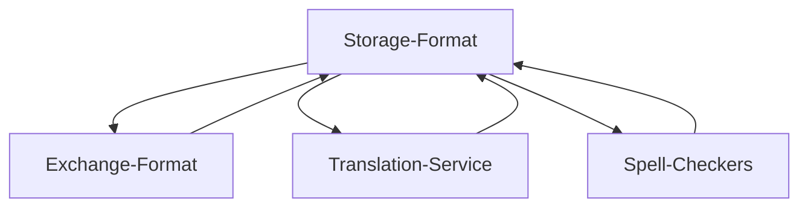

<p align="center">
   
</p>


Welcome to PHPUnuhi - The easy composable framework to validate and manage translations!

Only for PHP developers?! Absolutely NOT! This framework is for everyone who needs to manage translations in a
structured way.
It has only been developed in PHP ;)

Unuhi? This is Hawaiian for "translate" or "translation".

Why did I create it? Just curiosity and because I needed something like this :)
The framework is free, there's no guarantee or claim to anything.

**WHAT IT IS, AND WHAT IT'S NOT!!**

This is a dev-tool. It can be used to improve pipelines, workflows and QA processes.
It can also be used to get some quick start in adding languages or new sentences.
But it is NO replacement for services or people that/who translate in a professional way with context and knowledge
about the software.
Please keep that in mind to avoids misinterpreting the goal of this framework.

Now that you know this, let's get started!

<!-- TOC -->
  * [1. Basic Concept](#1-basic-concept)
  * [2. Installation](#2-installation)
  * [3. Configuration](#3-configuration)
  * [4. Commands](#4-commands)
    * [4.1 Validate All Command](#41-validate-all-command)
    * [4.2 Validate Mess Command](#42-validate-mess-command)
    * [4.3 Validate Coverage Command](#43-validate-coverage-command)
    * [4.4 Validate Structure Command](#44-validate-structure-command)
    * [4.5 Validate Spelling Command](#45-validate-spelling-command)
    * [4.6 Fix Structure Command](#46-fix-structure-command)
    * [4.7 Fix Mess Command](#47-fix-mess-command)
    * [4.8 Export Command](#48-export-command)
    * [4.9 Import Command](#49-import-command)
    * [4.10 Status Command](#410-status-command)
    * [4.11 Fix Spelling Command](#411-fix-spelling-command)
    * [4.12 Translate Command](#412-translate-command)
    * [4.13 List Translations Command](#413-list-translations-command)
    * [4.14 Migration Command](#414-migration-command)
    * [4.15 Scan Usage Command](#415-scan-usage-command)
  * [5. Validation Processes](#5-validation-processes)
    * [5.1 Structure Validation](#51-structure-validation)
    * [5.2 Empty content Validation](#52-empty-content-validation)
    * [5.3 Case-Style Validation](#53-case-style-validation)
    * [5.4 Rules Validation](#54-rules-validation)
  * [6. Use Cases](#6-use-cases)
    * [6.1 Validation in CI pipeline](#61-validation-in-ci-pipeline)
    * [6.2 Working with external translation agencies](#62-working-with-external-translation-agencies)
    * [6.3 Live WebEdit with HTML](#63-live-webedit-with-html)
    * [6.4 Automatic Translation with Google, DeepL, ...](#64-automatic-translation-with-google-deepl-)
  * [7. Warning](#7-warning)
  * [8. Appendix](#8-appendix)
      * [8.1 Imports](#81-imports)
      * [8.2 Locales](#82-locales)
    * [8.3 Storage Formats](#83-storage-formats)
      * [8.3.1 Formats](#831-formats)
        * [8.3.1.1 JSON](#8311-json)
        * [8.3.1.2 INI](#8312-ini)
        * [8.3.1.3 PO](#8313-po)
        * [8.3.1.4 PHP](#8314-php)
        * [8.3.1.5 Shopware 6](#8315-shopware-6)
        * [8.3.1.6 YAML](#8316-yaml)
      * [8.3.2 Custom Formats](#832-custom-formats)
    * [8.4 Filters](#84-filters)
    * [8.5 Groups](#85-groups)
    * [8.6 Case Styles](#86-case-styles)
    * [8.7 Rules](#87-rules)
      * [8.8.1 Nesting Depth](#881-nesting-depth)
      * [8.8.2 Key Length](#882-key-length)
      * [8.8.3 Disallowed Texts](#883-disallowed-texts)
      * [8.8.4 Duplicate Content](#884-duplicate-content)
      * [8.8.5 Empty Content](#885-empty-content)
    * [8.8 PHP ENV Variables](#88-php-env-variables)
    * [8.9 Exchange Formats](#89-exchange-formats)
      * [8.9.1 CSV](#891-csv)
      * [8.9.2 HTML / WebEdit](#892-html--webedit)
      * [8.9.3 JSON](#893-json)
      * [8.9.4 Custom Exchange Formats](#894-custom-exchange-formats)
    * [8.10 Translator Services](#810-translator-services)
      * [8.10.1 DeepL](#8101-deepl)
      * [8.10.2 Google Cloud Translate](#8102-google-cloud-translate)
      * [8.10.3 Google Web Translate](#8103-google-web-translate)
      * [8.10.4 OpenAI GPT Translate](#8104-openai-gpt-translate)
      * [8.10.5 Custom Translators](#8105-custom-translators)
    * [8.11 Validation Reports](#811-validation-reports)
      * [8.11.1 JUnit Report](#8111-junit-report)
      * [8.11.2 JSON Report](#8112-json-report)
    * [8.12 Protection](#812-protection)
    * [8.13 Coverage](#813-coverage)
    * [8.14 Scanners](#814-scanners)
    * [8.15 Spell Checkers](#815-spell-checkers)
      * [8.15.1 Aspell](#8151-aspell)
      * [8.15.2 OpenAI](#8152-openai)
<!-- TOC -->


<table>
  <tr>
    <td>
      <a href="https://www.youtube.com/watch?v=phaO7-1n3O0">
        
      </a>
      <p>Watch the latest (English) talk about PHPUnuhi.</p>
    </td>
    <td>
      <a href="https://www.youtube.com/watch?v=yeWyG5R0VZs">
        
      </a>
      <p>Watch the latest (German) webinar about PHPUnuhi.</p>
    </td>
  </tr>
</table>

## 1. Basic Concept

This is a framework that helps you to **validate and maintain translations**.

Although it's not dependent on a specific platform, you can use it perfectly with Shopware 6 and other platforms.

For example, Shopware 6 has snippets based on JSON files.
If you develop plugins for this platform, you can build translation sets in PHPUnuhi that contain all your files for the
individual languages, like EN, DE, NL, and whatever you support.
PHPUnuhi helps you to make sure you didn't forget any translations, screwed up structures across your language files and
even
helps you to export and import or translate your entries.

One of the benefits of this framework is the approach of decoupled **Storage formats**, **Exchange formats** and *
*Translation services**.
You can combine any storage format (JSON, INI, DB, ...) with any exchange format for import + exports (CSV, HTML, ...)
or use any of the provided
translation services (Google, DeepL, OpenAI). This makes PHPUnuhi a great **composable framework for translations**.



**Key Benefits**

* Validates translations against structure, missing values, and consistency based on CamelCase, KebabCase and more.
* Platform independent and composable framework with different components.
* Exchange formats such as CSV and HTML
* Live WebEdit with HTML exchange format
* Automatic translation using OpenAI (experimental), DeepL, Google and more
* Automatic validation and fixing of misspelled translations with Spell Checkers

<p align="center">
   
</p>


> Missing your platform or file format? Feel free to contribute :)

## 2. Installation

You can use PHPUnuhi with Composer. Just install it with this script.

```
composer require boxblinkracer/phpunuhi
```

You can then run it with this command, once you have a configuration.

```
php vendor/bin/phpunuhi validate
```

## 3. Configuration

The whole configuration is done using XML.

You can create different **Translation-Sets** in a configuration.

A single **Translation-Set** contains one or more **locales**.

A locale is usually defined by a **single file** that contains the actual **translations** in this locale.
But depending on the used storage format, it could also automatically search something in the database, etc.

This means, a single **Translation-Set** consists of **multiple locales** that should all match in their structure,
but have different values for their translations.

How you define such a Translation-Set is totally up to you.

Let's create a new **phpunuhi.xml** file (or rename it to something else).

```xml

<phpunuhi
        xmlns:xsi="http://www.w3.org/2001/XMLSchema-instance"
        xsi:noNamespaceSchemaLocation="./vendor/boxblinkracer/phpunuhi/config.xsd"
>
    <translations>

        <set name="Storefront">
            <format>
                <json/>
            </format>
            <locales>
                <locale name="de">./snippets/storefront/de.json</locale>
                <locale name="en">./snippets/storefront/en.json</locale>
            </locales>
        </set>

    </translations>
</phpunuhi>
```

This was a simple configuration, but you can also do way more.
Look at this one:

```xml

<phpunuhi
        xmlns:xsi="http://www.w3.org/2001/XMLSchema-instance"
        xsi:noNamespaceSchemaLocation="./vendor/boxblinkracer/phpunuhi/config.xsd"
>
    <translations>

        <set name="Storefront JSON">
            <format>
                <json indent="4" sort="true"/>
            </format>
            <locales>
                <locale name="de">./snippets/de.json</locale>
                <locale name="en">./snippets/%locale%.json</locale>
            </locales>
        </set>

        <set name="Products">
            <format>
                <shopware6 entity="product"/>
            </format>
            <filter>
                <exclude>
                    <key>meta_*</key>
                </exclude>
            </filter>
            <locales>
                <locale name="de-DE"/>
                <locale name="en-GB"/>
            </locales>
        </set>

    </translations>
</phpunuhi>
```

Every set can have its own **storage format** (default is JSON).

Some storage formats, such as JSON, have individual attributes that can be defined in the Translation-Set.

> Read more about optional attributes in the storage-format section in the appendix below.

## 4. Commands

### 4.1 Validate All Command

Start the full validation of your translations by running the following command.
This validates everything - easy and simple.

```bash 
# loads configuration phpunuhi.xml as default
php vendor/bin/phpunuhi validate:all 

# provide custom configuration
php vendor/bin/phpunuhi validate:all  --configuration=./translations.xml

# generate a junit report in a custom folder
php vendor/bin/phpunuhi validate:all  --report-format=junit --report-output=.reports/junit.xml

# ignore a configured coverage and use strict checks again
php vendor/bin/phpunuhi validate:all --ignore-coverage
```

### 4.2 Validate Mess Command

What is a mess? This is simply defined by translation keys that have no value in any of your locales.
So these keys might not even be used in your software, which means they can probably be removed.

To run the mess detection please run this command:

```bash 
php vendor/bin/phpunuhi validate:mess 

# provide custom configuration
php vendor/bin/phpunuhi validate:mess  --configuration=./translations.xml

# generate a junit report in a custom folder
php vendor/bin/phpunuhi validate:mess  --report-format=junit --report-output=.reports/junit.xml
```

### 4.3 Validate Coverage Command

You can also validate the coverage of your translations separately.

Start by configuring your coverage in your XML either for all translation sets
or each translation set.

> Please see Appendix to configure coverage values!

```bash 
php vendor/bin/phpunuhi validate:coverage 

# provide custom configuration
php vendor/bin/phpunuhi validate:coverage --configuration=./translations.xml
```

### 4.4 Validate Structure Command

This validates only the structure of your translations and no content or any rules.

```bash 
php vendor/bin/phpunuhi validate:structure 

# provide custom configuration
php vendor/bin/phpunuhi validate:structure --configuration=./translations.xml
```

### 4.5 Validate Spelling Command

The new concept of spell checkers allows you to also validate misspelled words.

If a misspelled word is found, the validation will fail.

```
php vendor/bin/phpunuhi validate:spelling --service=aspell --configuration=./translations.xml
```

### 4.6 Fix Structure Command

If your storage is not matching, you can easily use the fixing command to make sure they are in sync.
Please note, that this will only create empty translations so that the structure is the same.

The final translations are not 100% valid in the end...only existing!

```bash 
# Fixes all sets of the configuration
php vendor/bin/phpunuhi fix:structure

# Fixes only a provided set of your configuration
php vendor/bin/phpunuhi fix:structure --set="storefront"
```

<p align="center">
   
</p>

### 4.7 Fix Mess Command

This command will automatically remove all translation keys that have no value in any of your locales.
Keys detected by the **validate:mess** command might not be used after all.
So this command will remove them.

```bash 
# Fixes all sets of the configuration
php vendor/bin/phpunuhi fix:mess

# Fixes only a provided set of your configuration
php vendor/bin/phpunuhi fix:mess --set="storefront"
```

### 4.8 Export Command

You can export your translations **into a CSV file**, a HTML WebEdit spreadsheet, or other supported exchange formats.
These files can then be passed on to an external translator or company.

Every row will contain the translation key, and every column in that row will be a different translation (in case of CSV
files).

```bash 
# default export in default exchange format CSV
php vendor/bin/phpunuhi export 

# default export in specific exchange format
php vendor/bin/phpunuhi export ... --format=html

# provide custom export folder
php vendor/bin/phpunuhi export ... --dir=./exports

# only export single set "storefront"
php vendor/bin/phpunuhi export ... --set="storefront"

# only export translation entries that are not yet completely translated in all locales.
php vendor/bin/phpunuhi export ... --empty
```

> For more options and arguments of the formats please see the appendix below!

<p align="center">
   
</p>

### 4.9 Import Command

You can import your translations **from a CSV file** or other supported exchange formats.
This will automatically update the storage (JSON, ...) that has been assigned to the imported translation set.

> It's recommended to use version control to verify changes, before approving them.

```bash 
# import from default format CSV
php vendor/bin/phpunuhi import --set=storefront --file=storefront.csv

# import with other exchange format
php vendor/bin/phpunuhi import ... --format=html
```

### 4.10 Status Command

Use this command to get statistics and reports of your translations.
This includes the coverage and the number of found words.

```bash 
php vendor/bin/phpunuhi status 
```

<p align="center">
   
</p>

### 4.11 Fix Spelling Command

If you use a capable translator service that is able to fix a spelling for you, then you can use this
command to scan all your translations for misspelled texts.
New versions will be automatically stored in your storage.

> Like so many AI approaches, there is no 100% guarantee, so please use the Git diff to verify your changes.

```bash 
# Fixes all sets of the configuration
php vendor/bin/phpunuhi fix:spelling --service=openai ...

# Fixes only a provided set of your configuration
php vendor/bin/phpunuhi fix:spelling --set="storefront"
```

### 4.12 Translate Command

PHPUnuhi includes the option to use external services to automatically translate missing values for you.

The **translate** command will search for empty values in your translations.

If an empty translation is found, it will request a translation from your external service.
The text that will be translated in this request, is the translation from another language.

For instance, if your "English" translation is empty, PHPUnuhi will find your "German" text and send it to the external
service.
The English result is then saved in your storage.

```bash 
# translate using GoogleWeb
php vendor/bin/phpunuhi translate --service=googleweb

# translate using DeepL
php vendor/bin/phpunuhi translate --service=deepl --deepl-key=xyz

# translate only the set "storefront"
php vendor/bin/phpunuhi translate ... --set="storefront"

# force the translation of "en". This will translate everything, not only empty values
php vendor/bin/phpunuhi translate ...  --force=en

# define what locale will be used as source for the translation. 
# If not defined, any locale with an existing value will be used.
php vendor/bin/phpunuhi translate ...  --source=en
```

> For more options and arguments of the formats please see the appendix below!

<p align="center">
   
</p>

### 4.13 List Translations Command

This command allows you to output all available translation keys in your Translation-Sets.
Use this to debug and analyse your translations.

```bash 
php vendor/bin/phpunuhi list:translations 
```

### 4.14 Migration Command

It's also possible to migrate your translations from one storage to another.
Just use the migration command and provide the target storage as output format.

```bash 
php vendor/bin/phpunuhi migrate --output=json
```

### 4.15 Scan Usage Command

Usually you have template files that use your translation keys.
The scanner command helps to scan all these files and see if all your translation keys are actually used in there.

```bash 
php vendor/bin/phpunuhi scan:usage --dir=./src --scanner=twig

# provide custom configuration
php vendor/bin/phpunuhi scan:usage --dir=./src --scanner=twig --configuration=./translations.xml

# custom set
php vendor/bin/phpunuhi scan:usage --dir=./src --scanner=twig --set=storefront

# verbose mode to show more output, like scanned files and so on
php vendor/bin/phpunuhi scan:usage --dir=./src --scanner=twig --verbose
```

> Please note, this is only a helper command to find unused translations in template files.
> Keys that are found here, could still be used in other places, such as JS files, PHP files and more!
> Do not immediately remove them without thinking about it.

## 5. Validation Processes

PHPUnuhi has different validators integrated.
These are executed depending on your configuration and what command you are using.

While the command **validate:all** runs all validators, others might only use a specific validation process.

In a nutshell, this is a list of things that PHPUnuhi can test for you.

### 5.1 Structure Validation

The command will check if all locales of a Translation-Set have the **same structure**.
If not, you might have forgotten something ;)

<p align="center">
   
</p>

### 5.2 Empty content Validation

If missing translations (**empty values**) are found, the validation process will fail.
This helps against forgetting certain translations in any of your locales.

<p align="center">
   
</p>

### 5.3 Case-Style Validation

If you have provided a list of allowed case-styles, the validation command will automatically test
if all your translation keys, match your provided case styles.

### 5.4 Rules Validation

If you have provided specific rules such as max-nesting-depth or more,
these will be tested as well.

You can find possible rules in the appendix.

> Why not everything as rule? Because things where growing after time, and yes, it could all be a rule
> but still, the basic idea about rules is that they are really individual and configurable
> while the other validators are more meant as "core" and standard validation steps.

## 6. Use Cases

Here are a few use cases and ideas to get you started.

### 6.1 Validation in CI pipeline

One of the typical things you want to make sure is, that your plugin/software doesn't miss any
required translations.

This can be done directly within your CI pipeline. Just install your dependencies and run the validation command.
The exit value of this command will automatically stop your pipeline if an error is detected.

### 6.2 Working with external translation agencies

External translation agencies often require CSV exports.
You can easily generate and export a CSV file for your partner agencies.

Once they have adjusted their translation, they can send you the file back and you simply
import it again with the import command.

### 6.3 Live WebEdit with HTML

If you have a test or staging system, you can even go one step further.
Just imagine setting up a cronjob that runs after a deployment, or as scheduled job.
This cronjob could trigger the HTML export of PHPUnuhi with an output directory to a folder that is available within
your DocRoot.
That HTML file might then be exposed with something like this **https://stage.my-shop.com/snippets**.

Everyone who wants to either see all translations, or even modify them, can easily do this in their browser.
And because you use a cronjob to generate the HTML, it's always automatically updated.

### 6.4 Automatic Translation with Google, DeepL, ...

You can automatically translate your missing (or all) translations by using an external service.
This can be GoogleWeb, GoogleCloud or even DeepL.
Provide your API key (if required for service) and see the magic happening.

> A double check and approval in your version control would still be a good thing.

## 7. Warning

Please keep these things in mind:

* Translations services are not always correct! Please always verify automatically translated texts.
* If you are using a storage format that is directly connected to a database, make sure to create a backup before
  importing translations!

## 8. Appendix

#### 8.1 Imports

You can import other configuration files into your main configuration.
This is useful if you want to split your configuration into multiple files and bundles.

```xml 

<phpunuhi>
    <imports>
        <import resource="./folder/sub_config.xml"/>
    </imports>

    <translations>
        ...
    </translations>
</phpunuhi>
```

#### 8.2 Locales

Every translation set consists of multiple **locales**.
Every locale is defined through a name and either a filename, or database-table (depending on format type).
The purpose is, that every locale in a translation-set should match across those languages (all files should have the
same structure for example).

You can also specify what locale is the base locale using the attribute **base="true"**.
This will be used for certain features where it's necessary to know the base locale that should contain all values.
Translations services e.g. will prefer the base locale as the source for translations, if defined and no other source is specified in the command.

This is how you can define locales (with files in this sample).
You can also use a placeholder **%locale%**, **%locale_lc%**, **%locale_uc%** and **%locale_un%** in the value to make things easier for
you.
This will reuse the locale name in the filename.
**locale_lc** is lower case and **locale_uc** is upper case.
**%locale_un%** change `-` to `_` underscore. (fr-CH to fr_CH)

If you have all files in the same base directory, you can also provide a placeholder for the **basePath** and
use this one also for the directories of your files.

```xml

<set name="sample">
    <locales basePath="./Bundles/MySuperBundle/Resources/snippets/%locale_un%">
        <!-- Bundles/MySuperBundle/Resources/snippets/DE/storefront-de.json -->
        <locale name="DE" base="true">%base_path%/storefront-%locale_lc%.json</locale>

        <!-- Bundles/MySuperBundle/Resources/snippets/en/storefront-EN.json -->
        <locale name="en">%base_path%/storefront-%locale_uc%.json</locale>

        <!-- Bundles/MySuperBundle/Resources/snippets/fr_CH/storefront-fr-CH.json -->
        <locale name="fr-CH">%base_path%/storefront-%locale%.json</locale>
    </locales>
</set>
```

### 8.3 Storage Formats

Storage formats define how your translations are stored.
Every format has its own loading and saving implementation.

#### 8.3.1 Formats

The following formats are currently supported.

##### 8.3.1.1 JSON

| Format Attributes | Default | Description                             | 
|-------------------|---------|-----------------------------------------|
| indent            | 2       | Set a custom JSON indent for the spaces |
| sort              | false   | Turn on or off the alphabetical sorting |
| eol-last          | false   | Adds a new line at the end of the file  |

The JSON format means that your files are stored in separate JSON files.
Every locale has its own JSON file.
The JSON structure across all files of a set should match.

```xml

<set name="sample">
    <format>
        <json indent="4" sort="true"/>
    </format>
    <locales>
        <locale name="de">./snippets/de.json</locale>
        <locale name="en">./snippets/en.json</locale>
    </locales>
</set>
```

##### 8.3.1.2 INI

| Format Attributes | Default | Description                             | 
|-------------------|---------|-----------------------------------------|
| sort              | false   | Turn on or off the alphabetical sorting |
| eol-last          | false   | Adds a new line at the end of the file  |

| Locale Attribute | Default | Description                                  | 
|------------------|---------|----------------------------------------------|
| iniSection       |         | Section name of the locale [iniSection="de"] |

The INI format means that your files are stored in separate INI files.
Every locale has its own INI file.
The INI structure across all files of a set should match.

It's also possible to have all translations in a single INI file.
For this, you might want to use the **iniSection** feature and just assign the same INI file to all locales, but with
different sections.

```xml

<set name="sample">
    <format>
        <ini sort="true"/>
    </format>
    <locales>
        <locale name="de">./snippets/de.ini</locale>
        <locale name="en">./snippets/en.ini</locale>
    </locales>
</set>

<set name="sample">
<format>
    <ini sort="true"/>
</format>
<locales>
    <locale name="de" iniSection="de-DE">./snippets/snippets.ini</locale>
    <locale name="en" iniSection="en-GB">./snippets/snippets.ini</locale>
</locales>
</set>
```

##### 8.3.1.3 PO

Some platforms have translations based on PO files.

This storage type makes sure to read and also write PO files.
At the moment it only covers the **msgid** and **msgstr** fields.

```xml

<set name="sample">
    <format>
        <po/>
    </format>
    <locales>
        <locale name="de">./snippets/de.php</locale>
        <locale name="en">./snippets/en.php</locale>
    </locales>
</set>
```

##### 8.3.1.4 PHP

| Format Attributes | Default | Description                             | 
|-------------------|---------|-----------------------------------------|
| sort              | false   | Turn on or off the alphabetical sorting |
| eol-last          | false   | Adds a new line at the end of the file  |

Some platforms have translations based on PHP arrays.
This means that these files build a key-value array of translations which is then simply returned.

Consuming services can then simply "require" that file and therefore load the translation array.

This storage type makes sure to read and also write PHP files that return a single array object.

```xml

<set name="sample">
    <format>
        <php sort="true"/>
    </format>
    <locales>
        <locale name="de">./snippets/de.php</locale>
        <locale name="en">./snippets/en.php</locale>
    </locales>
</set>
```

##### 8.3.1.5 Shopware 6

| Format Attributes | Default | Description                            | 
|-------------------|---------|----------------------------------------|
| entity            |         | The entity your Translation-Set covers |

The Shopware 6 format allows you to use PHPUnuhi directly on the database and the Shopware entities.

What do we mean with entities? These are real objects of the platform, stored within the database.
This means **snippets**, **products**, **salutations**, **shipping methods** and more. Basically, everything that has a
**_translation** table in the database.

Just imagine running the **status command** and see a translation coverage of all your products in your shop. Nice,
isn't it? Or let DeepL translate your data automatically?!

To access the database of Shopware, you can either make sure the ENV variables for the connection are correctly set up,
or provide your custom credentials in the **php** section of the configuration XML.

Please keep in mind, snippets are handled in a different way in the database.
To make life easier for you, we've added a fake entity name **snippet** that automatically connects to the snippet table
instead of an entity translation table.

```xml

<phpunuhi>
    <php>
        <env name="DB_HOST" value="128.0.0.1"/>
        <env name="DB_PORT" value="3306"/>
        <env name="DB_USER" value=""/>
        <env name="DB_PASSWD" value=""/>
        <env name="DB_DBNAME" value="shopware"/>
    </php>

    <translations>

        <set name="Products">
            <format>
                <shopware6 entity="product"/>
            </format>
            <locales>
                <locale name="de-DE"/>
                <locale name="en-GB"/>
            </locales>
        </set>

        <set name="categories">
            <format>
                <shopware6 entity="category"/>
            </format>
            <locales>
                <locale name="en-GB"/>
                <locale name="de-DE"/>
            </locales>
            <filter>
                <include>
                    <key>name</key>
                </include>
            </filter>
        </set>

        <set name="Snippets">
            <format>
                <shopware6 entity="snippet"/>
            </format>
            <locales>
                <locale name="de-DE"/>
                <locale name="en-GB"/>
            </locales>
        </set>

        <set name="State Machine States">
            <format>
                <shopware6 entity="state_machine_state"/>
            </format>
            <locales>
                <locale name="de-DE"/>
                <locale name="en-GB"/>
            </locales>
        </set>

    </translations>
</phpunuhi>
```

##### 8.3.1.6 YAML

| Format Attributes | Default | Description                             | 
|-------------------|---------|-----------------------------------------|
| indent            | 2       | Set a custom YAML indent for the spaces |
| sort              | false   | Turn on or off the alphabetical sorting |
| eol-last          | false   | Adds a new line at the end of the file  |

The YAML format means that your files are stored in separate YAML files.
Every locale has its own YAML file.
The YAML structure across all files of a set should match.

```xml

<set name="sample">
    <format>
        <yaml indent="4" sort="true"/>
    </format>
    <locales>
        <locale name="de">./snippets/de.yaml</locale>
        <locale name="en">./snippets/en.yaml</locale>
    </locales>
</set>
```

#### 8.3.2 Custom Formats

It's also possible to register your custom storages.
Create a class and implement the **StorageInterface** according to your needs.

Then simply register your storage using this function:

```php
StorageFactory::getInstance()->registerStorage($myStorage);
```

The easiest approach is to use a **bootstrap** file and assign it in your XML configuration
to load your custom storage.

```xml

<phpunuhi
        bootstrap="./autoload.php">
</phpunuhi>
```

### 8.4 Filters

It's possible to use filters to modify the list of covered translation keys.

You can either use a **include** or **exclude** list.
Include means, only these fields will be loaded, and exclude means, everything except those fields.
A combination is not possible.

You can also use **placeholders** using the * character.

```xml

<set>
    <filter>
        <include>
            <key>name</key>
        </include>
        <exclude>
            <key>custom_fields</key>
            <key>meta_*</key>
        </exclude>
    </filter>
</set>
```

### 8.5 Groups

Some storage formats automatically bundle translations into groups.
This means, that more translations belong to one "thing".
That thing depends on the type of storage format.

For instance, in Shopware 6, a group is a "entity".
So for a Translation-Set on "products", 1 group stands for a specific product, and has multiple translations for the
different product properties.

If a group is detected, the exchange formats, should handle these in a correct way.
A CSV format, has a separate column for groups, and the import should also work correctly.

The HTML format on the other hand, shows a matching style in the table, so you know that the
translations all belong to this group.

### 8.6 Case Styles

To keep consistency across all your translation keys, it's possible to set a list of allowed case styles.
The **validate** command, will automatically test, if all your translation keys match at least one of the provided
styles.

If no style is provided, then case-style tests are skipped.

The following styles are possible:

* camel
* pascal
* kebab
* lower
* upper
* snake
* start
* number
* none

Please note that **none** can be used to explicitly disable case-style checks for a specific level,
while other levels might validate against configured styles. This is useful for legacy constructs with old keys.

```xml

<set>
    <styles>
        <style>pascal</style>
        <style>kebab</style>
    </styles>
</set>
```

In addition to global case-styles, you can also set specific styles on **specific levels** if you have a nested storage
such as JSON or PHP.

You can even mix it with styles that do not have a level.
In that case, styles without levels, are globally checked for every level that does not already have a specific style
for its level.

Here is an example that would be "valid" for this key: **global.businessEvents.mollie_checkout_order_success**.
Camel case would be only checked on level 1, and not on level 0 and 2.

```xml

<set>
    <styles>
        <style level="0">snake</style>
        <style level="2">snake</style>
        <style>camel</style>
    </styles>
</set>
```

Sometimes you are working in a platform where key names exist that just need to be like this, even though
your guidelines would be something else. In this case you can add those keys to an **ignore list**.
Keys that are ignored, will not be considered for case style validation.

You can tell the validator if you are providing the key with its full nesting-level by using the attribute **fqp** (Fully Qualified Path).
If set to TRUE, the validation process will use an exact match that includes the full nesting-level of the key (root.sub.MY_WEIRD_KEY).
If set to FALSE, then the key name is searched everywhere, regardless of its nesting-level.
The default value for the fqp attribute is TRUE, if not provided.

```xml

<set>
    <styles>
        <style>snake</style>
        <ignore>
            <key>root.sub.MY_WEIRD_KEY</key>
            <key fqp="true">root.sub.MY_WEIRD_KEY</key>
            <key fqp="false">MY_WEIRD_KEY</key>
        </ignore>
    </styles>
</set>
```

### 8.7 Rules

You can add additional rules to extend the validation of your Translation-Sets.
Please see the list below for all supported rules.

```xml

<set>
    <rules>
        <duplicateContent>false</duplicateContent>
        <nestingDepth>3</nestingDepth>
        ...
    </rules>
</set>
```

#### 8.8.1 Nesting Depth

The nesting-depth rule allows you to throw an error once the maximum depth is reached within a nested storage type.
This helps you to keep your depth in control.

```xml

<nestingDepth>3</nestingDepth>
```

#### 8.8.2 Key Length

The key-length rule allows you to throw an error once the maximum length of a key is reached

```xml

<keyLength>20</keyLength>
```

#### 8.8.3 Disallowed Texts

Provide a list of texts that must not occur in any of your translations.
You can use this for anything you want, like swearing words, political incorrect phrases and more.

```xml

<disallowedTexts>
    <text>wordA</text>
    <text>wordB-phrase</text>
</disallowedTexts>
```

#### 8.8.4 Duplicate Content

Sometimes you want to keep translations clean and reduced by avoiding duplicate values within a locale.
Just imagine the simple translation value "Save" occurring multiple times in a single locale?
Wouldn't it be better to just have it in 1 single translation entry in your file?

In this case you can use this rule.
Once set to **false**, the validator will automatically warn you, if you have a translation value configured multiple
times within a single locale.

You need to configure this rule per locale.
If you want to configure all locales (or all that are not explicitly configured), you can use the wildcard for the rest.

```xml

<duplicateContent>
    <locale name="de">false</locale>
    <locale name="*">true</locale>
</duplicateContent>
```

#### 8.8.5 Empty Content

Sometimes it's necessary to specify that it's okay to have an empty translation value.
Maybe because a social media link is not different in any locale, and somehow must not even be translated.

For this specific use case, there is the option to provide an "allow list" of keys that can stay empty.

If you want to allow it being empty in all your languages, use a wildcard locale or even skip the locales.

```xml

<emptyContent>
    <key name="social_media.youtube.link">
        <locale>*</locale>
    </key>
    <key name="social_media.facebook.link"/>
</emptyContent>
```

Besides that, you can specify the locales that are allowed to be empty.

```xml 

<emptyContent>
    <key name="social_media.youtube.link">
        <locale>DE</locale>
        <locale>IT</locale>
        <locale>FR</locale>
    </key>
</emptyContent>
```

Your validations will now always pass, if the conditions for empty translations based on this rule are met.

### 8.8 PHP ENV Variables

The XML configuration allows you to create custom ENV variables.
Depending on the components you use in PHPUnuhi, some require specific ENV variables, such as the Shopware 6 database
connection.
These can either be set by exporting the ENV variable on your server, or by simply providing them in the XML
configuration.

```xml

<phpunuhi>
    <php>
        <env name="DB_HOST" value="128.0.0.1"/>
        <env name="DB_PORT" value="3306"/>
        <env name="DB_USER" value=""/>
        <env name="DB_PASSWD" value=""/>
        <env name="DB_DBNAME" value="shopware"/>
    </php>
</phpunuhi>
```

### 8.9 Exchange Formats

Exchange formats define how you export and import translation data.
The main purpose is to send it out to a translation company or just someone else,
and be able to import it back into your system again.

The following formats are currently supported.

#### 8.9.1 CSV

* Format: "csv"

| Command | Argument        | Description                                             |
|---------|-----------------|---------------------------------------------------------|
| export  | --csv-delimiter | Custom delimiter for the CSV file [--csv-delimiter=";"] |
| import  | --csv-delimiter | Custom delimiter for the CSV file [--csv-delimiter=";"] |

The CSV format is a well known and solid format for interoperability.
You can open CSV files with Microsoft Excel, Apple Numbers as well as simple text editors or more.
The only downside with Excel and Numbers is, that they might force you to save the updated file in their own formats (
just pay attention to this).

The benefit is that you can simply open all translation in a spreadsheet.
Every translation key has its own row, and all locale-values have their own column in that row.

<p align="center">
   
</p>

#### 8.9.2 HTML / WebEdit

* Format: "html"

The HTML export helps you to export all translations into a single HTML file.
You can then open this file in your browser and immediately start to edit your translations.

Once finished, just click on "save translations". This will download a **html.txt** file that
you can import again into your system with the format **html** in PHPUnuhi.

<p align="center">
   
</p>

#### 8.9.3 JSON

* Format: "json"

The JSON format is a simple JSON file that contains a list of all your
translation keys and their values.

```json 
{
  "id": "group--state_machine_018f6237aded716a9d5d74d49254115d.name",
  "group": "state_machine_018f6237aded716a9d5d74d49254115d",
  "key": "name",
  "en-GB": "Refund state",
  "de-DE": "Erstattungsstatus"
}
```

#### 8.9.4 Custom Exchange Formats

It's also possible to register your custom exchange formats.
Create a class and implement the **ExchangeInterface** according to your needs.

Then simply register your exchange format using this function:

```php
ExchangeFactory:: getInstance()->registerExchangeFormat($myFormat);
```

The easiest approach is to use a **bootstrap** file and assign it in your XML configuration
to load your custom storage.

```xml

<phpunuhi
        bootstrap="./autoload.php">
</phpunuhi>
```

### 8.10 Translator Services

Translators are supported (external) services that automatically translate empty values for you.
These services usually require an API key that needs to be provided for PHPUnuhi.

#### 8.10.1 DeepL

* Service: "deepl"

| Command   | Argument       | Description                                           |
|-----------|----------------|-------------------------------------------------------|
| translate | --deepl-key    | Your DeepL API Key. [--deepl-key=xyz]                 |
| translate | --deepl-formal | just provide this flag if you want a formal language. |

DeepL is one of the leading translation services.
If you have an API Key from DeepL, you can send your translation requests directly to their API.

DeepL allows you to either translate to a formal or informal language.
This option is only available for some target languages, just like "German" ("du" vs. "Sie").
You can request a formal language by simply applying the argument "--deepl-formal" to the translate command.

#### 8.10.2 Google Cloud Translate

* Service: "googlecloud"

| Command   | Argument     | Description               |
|-----------|--------------|---------------------------|
| translate | --google-key | Your Google Cloud API Key |

Google Cloud Translation allows you to use the AI services of Google.
If you have an API Key, you can easily provide it with the corresponding argument when running the translation command.

#### 8.10.3 Google Web Translate

* Service: "googleweb"

This service just consumes the web page of Google.
So it's the same thing that you would do when just visiting the Google search page.
Because of this, it can happen, that a massive number of requests might lead to a temporary blocking of your IP address.

This is more meant for educational purposes.
Although it works, you should consider getting a real Google API key for commercial and serious usage of their services.

#### 8.10.4 OpenAI GPT Translate

* Service: "openai"

| Command   | Argument       | Description                                     |
|-----------|----------------|-------------------------------------------------|
| translate | --openai-key   | Your OpenAI Key                                 |
| translate | --openai-model | The OpenAI model you want to use such as gpt-4o |

This type of translator uses the latest OpenAI technology to translate your texts.
Let AI help you to translate your texts.

To use it, you need to create an API key at www.openai.com and provide it as argument.
That's it!

This was indeed a last minute addon, but it works quite good.
If you have any tweaks, feel free to contribute :)

#### 8.10.5 Custom Translators

It's also possible to register your custom translators.
Create a class and implement the **TranslatorInterface** according to your needs.

Then simply register your translator using this function:

```php
TranslatorFactory::getInstance()->registerTranslator($myTranslator);
```

The easiest approach is to use a **bootstrap** file and assign it in your XML configuration
to load your custom storage.

```xml

<phpunuhi
        bootstrap="./autoload.php">
</phpunuhi>
```

### 8.11 Validation Reports

It's possible to generate reports after running a **validation** command. This helps you to use
the results in different systems and platforms.

The validation command has 2 arguments **--report-format=xyz** and **--report-output=abc** to provide
a certain format and a custom output filename. Use this to generate reports based on validation results.

#### 8.11.1 JUnit Report

You can generate a JUnit XML report by providing the following arguments when starting the validation.

* Report Format: "junit"

#### 8.11.2 JSON Report

You can generate a JSON report by providing the following arguments when starting the validation.

* Report Format: "json"

### 8.12 Protection

PHPUnuhi allows you to configure markers or even full terms and protect them from being translated.
Why would you need this?!

Some storage formats (or even use cases) might contain placeholders inside the text value.
This usually helps a software to replace such a placeholder with a real value.
Here is a sample:

```ruby 
"lblGreeting": "Hi, welcome {firstname}"
```

The text contains the placeholder **{firstname}**, but the software uses this static key and replaces it with the
real firstname of the customer. That means, this placeholder must not be translated by a translation service!

The protection feature allows you to add a list of **markers** to your translation-set.
A marker consists of the **start** and **end** text for such a placeholder.

It's also possible to configure full **terms** that must not be translated.
This is perfect if you have brand names or just any word that should not be accidentally translated.

```xml

<set>
    ...
    <protect>
        <marker start="{" end="}"/>
        <marker start="%" end="%"/>
        <marker start=""/>
        <term>Shopware</term>
        <term>iPhone</term>
    </protect>
</set>
```

### 8.13 Coverage

You can also configure the coverage of your translations.

This means you can either define that all your locales in a single TranslationSet require a specific
coverage separately or in total, or you can even define that all your
locales across all translation sets require a specific coverage in a specific locale or in total.

Start by configuring your coverage in your XML either for all translation sets
or each translation set.

```xml

<coverage minCoverage="20">
</coverage>
```

```xml

<coverage>
    <locale name="de">100</locale>
    <locale name="en">80</locale>
</coverage>
```

These **coverage** nodes can either be used on root level inside `<phpunuhi>` or
within each `<set>` node.

Here is a sample that has all coverage options set.
Please keep in mind, that this does not make sense and work of course.

```xml 

<phpunuhi>

    <translations>

        <set name="Administration">
            <format>
                <json indent="2" sort="true" eol-last="true"/>
            </format>
            <locales>
                <locale name="en">en.json</locale>
                <locale name="de">de.json</locale>
            </locales>
            <coverage minCoverage="80">
                <locale name="de">80</locale>
                <locale name="en">80</locale>
            </coverage>
        </set>

    </translations>

    <coverage minCoverage="80">
        <locale name="de">80</locale>
        <locale name="en">80</locale>
    </coverage>

</phpunuhi>
```

> Attention, once a coverage has been configured, the validation:all command will not
> work as strict as before. Strict errors will only be warnings, and only the coverage
> result is considered for the CLI exit code.
> However, you can provide a separate option to force strict validation again.

### 8.14 Scanners

Scanners allow you to scan your files for occurrences of translations keys.
This allows you to e.g. scan your TWIG files and see if all your keys are actually used somewhere.

The following list of scanners are currently supported:

* twig
* mjml

It's also possible to register your custom scanner.
Create a class and implement the **ScannerInterface** according to your needs.

Then simply register your translator using this function:

```php
ScannerFactory::getInstance()->registerScanner($myScanner);
```

### 8.15 Spell Checkers

Spell Checkers allow you to check your translations for misspelled words.
These can be used for validation processes but also for fixing your translations by automatically correcting misspelled.

You can use one of the built-in services such as Aspell or Open AI.
Every service comes with different benefits and drawbacks.

```php
SpellCheckerFactory::getInstance()->registerSpellChecker($mySpellChecker);
```

#### 8.15.1 Aspell

* Service: "aspell"

| Command                         | Argument | Description                             |
|---------------------------------|----------|-----------------------------------------|
| fix:spelling, validate:spelling | --binary | Individual path to binary, if not found |

Aspell is a well known spell checker that can be used to check your translations for misspelled words.
It's a command line tool that is available on most systems.

Please make sure to install it properly on your system before using it.

#### 8.15.2 OpenAI

* Service: "openai"

| Command                         | Argument       | Description                                     |
|---------------------------------|----------------|-------------------------------------------------|
| fix:spelling, validate:spelling | --openai-key   | Your OpenAI Key                                 |
| fix:spelling, validate:spelling | --openai-model | The OpenAI model you want to use such as gpt-4o |

With the OpenAI service you do even get improvements for gramma and not just spelling.